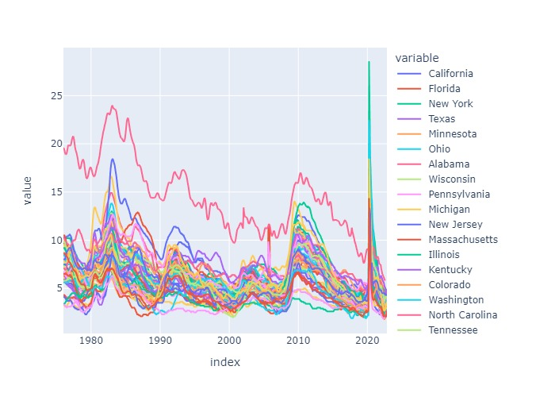

# Unemployment Rate Analysis
This Python script retrieves and visualizes unemployment rate data from the Federal Reserve Economic Data (FRED) API. It uses the fredapi and plotly libraries to access and plot the data.

A FRED API key, which can be obtained by signing up for a FRED account at https://fred.stlouisfed.org/

---

Import Required Libraries:

- fredapi

- pandas

- numpy

- matplotlib

- plotly

---

## Overview

The script starts by importing the required libraries and setting some formatting options. It then loads environment variables from a .env file using the dotenv library and retrieves the FRED API key from an environment variable.

Next, the script uses the Fred class from the fredapi library to connect to the FRED API. It then performs a search for the term "unemployment" using the search method of the Fred object. This returns a list of matching series, including the national unemployment rate (identified by the series ID "UNRATE").

The script retrieves the national unemployment rate using the get_series method of the Fred object and plots it using matplotlib.

The script then performs another search, this time filtering the results by frequency ("Monthly") and looking for series that contain the term "unemployment rate state". It filters the search results further by looking for series that are "Seasonally Adjusted" and have units of "Percent". It also filters the search results to include only series that contain the phrase "Unemployment Rate in".

The script then retrieves the data for each of the resulting series using the get_series method of the Fred object. It stores the data in a list of dataframes and concatenates them into a single dataframe using pandas. It then cleans up the dataframe by dropping some unnecessary columns and renaming the remaining columns using a dictionary that maps series IDs to state names.

Finally, the script plots the unemployment rate for each state using plotly.express. It also generates a horizontal bar plot showing the unemployment rate for each state in April 2020, using matplotlib.

---

**File:** [Unemployment](Unemployment.ipynb)

---

## Step 1: Get data

For this example we will use the FRED API to search for unemployment results.

The focus of the dataset will be each states unemployment rate (historical to current)

**Unemployment Rate Plot**

---

## Step 2: Iterate through each series id and pull series data

Create a loop to iterate through each states id and pull the data in a series. 

Concat dataframes of all states into a single dataframe
Change the name of the FRED abbreviates to actual state names

---

## Step 3: List Comprehension
Isolate the state names from the title by replacing 'Unemployment Rate in' with nothing
Drop the irrelivant columns
Turn output to dictionary

**Visualize the unemployment rates for all states**

---

## Step 4: Investigate Significant spike in unemployment rate  

investigate the spike by pulling april 2020 unemployment rate per state

transpose the dataframe to make the date the column and the states each row

sort values to visualize ascending order of lowest to highest unemployment rate

**Unemployment Rate by State**

## Usage:

Set the FRED API key as an environment variable using export FRED=your_api_key.

Run the script using python unemployment_rate.py.

The script will retrieve the national unemployment rate from FRED and plot it using matplotlib. It will also retrieve and plot the unemployment rate 
for each U.S. state from FRED, and generate a horizontal bar plot showing the unemployment rate for each state in April 2020.

Notes
The script loads environment variables from a .env file using the dotenv library. 

Make sure to set the FRED API key in the .env file or as an environment variable.

The script uses the plotly library to generate interactive plots that can be zoomed and panned.

The script assumes that the unemployment rate data is in the format "Seasonally Adjusted"

